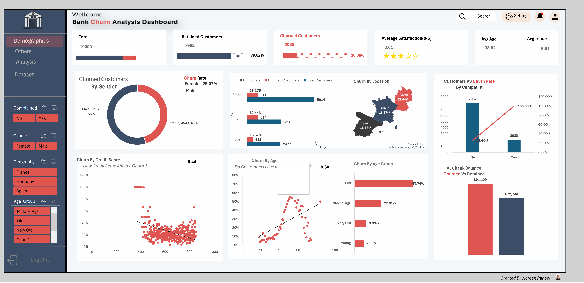
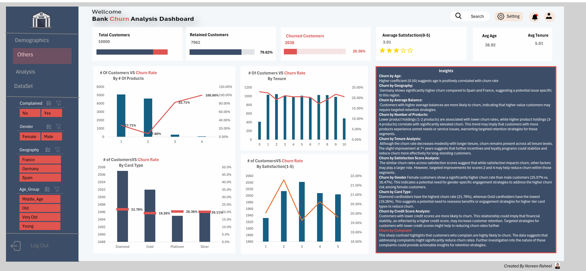

<div align="center">

# 📊 Bank Customer Churn Analysis Dashboard

### 🏦 Excel-Based Interactive Analytics Solution

[](https://www.microsoft.com/en-us/microsoft-365/excel)
[]()
[]()
[]()

**An interactive Excel dashboard for analyzing bank customer churn patterns. Built using a single Excel file containing raw data, Power Query transformations, DAX measures, and interactive dashboards.**

[Features](#-features) • [Installation](#-installation) • [Usage](#-usage) • [Architecture](#-architecture) • [Insights](#-key-insights) • [Author](#-author)

</div>

---

## 📑 Table of Contents

- [Project Overview](#-project-overview)
- [Key Highlights](#-key-highlights)
- [Tech Stack](#-tech-stack)
- [Dataset Information](#-dataset-information)
- [Features](#-features)
- [Business Problem](#-business-problem)
- [Dashboard Goal](#-dashboard-goal)
- [Architecture](#-architecture)
- [DAX Measures](#-dax-measures)
- [Dashboard Walkthrough](#-dashboard-walkthrough)
- [Key Insights](#-key-insights)
- [Business Impact](#-business-impact)
- [Installation & Setup](#-installation--setup)
- [How to Use](#-how-to-use)
- [Project Structure](#-project-structure)
- [File Specifications](#-file-specifications)
- [Screenshots](#-screenshots)
- [Troubleshooting](#-troubleshooting)
- [Future Enhancements](#-future-enhancements)
- [Author](#-author)

---

## 📌 Project Overview

The **Bank Customer Churn Analysis Dashboard** is a comprehensive Excel-based analytics solution that helps banking institutions analyze customer churn patterns and identify key factors contributing to customer attrition.

Built as a **single-file Excel solution**, this project combines raw data, Power Query transformations, Power Pivot data modeling, DAX calculations, and interactive visualizations into one cohesive `.xlsx` file.

The dashboard transforms **10,000+ customer records** into actionable business insights through:
- Interactive KPIs
- Demographic analysis
- Geographical visualization
- Correlation analysis
- Automated insights panel
- Dynamic slicers and filters

**Designed for:**
- 🏦 Banking Analysts
- 📊 Customer Retention Teams
- 💼 Risk Management Professionals
- 📈 Marketing Strategists
- 💼 Banking Decision Makers
- 📚 Data Analytics Students

---

## 🌟 Key Highlights

| Highlight | Details |
|-----------|---------|
| 📁 **Single File Solution** | Data + Dashboard in one `.xlsx` file |
| 📊 **10,000+ Records** | Comprehensive customer dataset |
| 🧠 **30+ DAX Measures** | Advanced calculated measures |
| 🎛 **4 Interactive Slicers** | Geography, Gender, Card Type, Complained |
| 📈 **12+ Visualizations** | Charts, maps, scatter plots, donut charts |
| 🤖 **Automated Insights Panel** | Dynamic business recommendations |
| 🌍 **3 Countries** | France, Germany, Spain |
| 💳 **4 Card Types** | Diamond, Gold, Platinum, Silver |
| 📅 **19 Attributes** | Demographic + Behavioral + Account data |

---

## 🛠 Tech Stack

This project was built using the following Microsoft Excel technologies:

| Technology | Purpose |
|------------|---------|
| 📊 **Microsoft Excel** | Main platform for dashboard |
| 🔄 **Power Query** | Data cleaning & transformation |
| 🧠 **DAX (Data Analysis Expressions)** | Calculated measures and KPIs |
| 🔗 **Power Pivot** | Data modeling and relationships |
| 📈 **Pivot Tables** | Data summarization |
| 🎨 **Conditional Formatting** | Dynamic visual indicators |
| 🎛 **Slicers** | Interactive filtering |
| 📁 **File Format** | `.xlsx` (Excel 2016+ Pro Plus) |

> ⚠️ **System Requirements:** This dashboard requires **Excel Desktop (Windows)** with Power Pivot enabled. Not compatible with Excel Online, Excel for Mac, or mobile versions.

---

## 📂 Dataset Information

The dashboard uses a bank customer dataset containing **10,000 customer records** with **19 attributes**.

### Dataset Schema (19 Columns)

| # | Column Name | Data Type | Description | Example |
|---|-------------|-----------|-------------|---------|
| 1 | `CustomerId` | Integer | Unique customer identifier | 15634602 |
| 2 | `Surname` | Text | Customer last name | Smith |
| 3 | `CreditScore` | Integer | Credit score (300-850) | 650 |
| 4 | `Geography` | Text | Country location | France / Germany / Spain |
| 5 | `Gender` | Text | Customer gender | Male / Female |
| 6 | `Age` | Integer | Customer age | 35 |
| 7 | `Age_Group` | Text | Age category | Young / Middle-aged / Senior |
| 8 | `Tenure` | Integer | Years as customer (0-10) | 5 |
| 9 | `Balance` | Decimal | Account balance | 125000.50 |
| 10 | `NumOfProducts` | Integer | Number of bank products (1-4) | 2 |
| 11 | `HasCrCard` | Boolean | Has credit card (1=Yes, 0=No) | 1 |
| 12 | `IsActiveMember` | Boolean | Active membership (1=Yes, 0=No) | 1 |
| 13 | `EstimatedSalary` | Decimal | Estimated annual salary | 75000.00 |
| 14 | `Churned` | Boolean | Churned status (1=Yes, 0=No) | 0 |
| 15 | `Complained` | Boolean | Has complained (1=Yes, 0=No) | 0 |
| 16 | `Satisfaction Score` | Integer | Customer rating (1-5) | 3 |
| 17 | `Card Type` | Text | Card category | Diamond / Gold / Platinum / Silver |
| 18 | `Point Earned` | Integer | Loyalty points earned | 850 |

**Note:** The dataset uses `Churned` as the primary churn indicator.

### Data Distribution

| Metric | Value |
|--------|-------|
| Total Records | 10,000 |
| Countries | 3 |
| Gender Split | 54.57% Male / 45.43% Female |
| Age Range | 18 - 92 years |
| Tenure Range | 0 - 10 years |
| Churn Rate | 20.38% |
| Retention Rate | 79.62% |

---

## ✨ Features

### 📊 Dashboard Features

- ✅ **Executive KPI Summary** - High-level business metrics
- ✅ **Churn by Gender Analysis** - Male vs Female comparison
- ✅ **Geographical Churn Map** - Country-wise visualization
- ✅ **Churn by Age Analysis** - Correlation & age groups
- ✅ **Churn by Credit Score** - Financial health correlation
- ✅ **Churn by Number of Products** - Product portfolio analysis
- ✅ **Churn by Tenure** - Customer loyalty impact
- ✅ **Churn by Card Type** - Card-wise comparison
- ✅ **Churn by Satisfaction Score** - Service quality impact
- ✅ **Average Balance Comparison** - Churned vs Retained
- ✅ **Automated Insights Panel** - Dynamic business recommendations
- ✅ **Interactive Slicers** - Dynamic filtering

### 🔧 Technical Features

- ✅ Single-file Excel solution
- ✅ Power Query automated data pipeline
- ✅ 30+ DAX measures for advanced calculations
- ✅ Power Pivot data model
- ✅ Multiple Pivot Tables
- ✅ Conditional formatting
- ✅ Dynamic charts and visualizations
- ✅ Cross-filtering between visuals
- ✅ Mobile-responsive design (Excel mobile app compatible)

---

## 📌 Business Problem

Banks face significant revenue loss when customers close their accounts and move to competitors. Without a centralized analytics solution, banks struggle to answer critical questions:

- ❓ What is the overall customer churn rate?
- ❓ Which gender is more likely to churn?
- ❓ Which countries have the highest churn?
- ❓ Does age affect churn behavior?
- ❓ How does credit score influence churn?
- ❓ Does the number of products impact retention?
- ❓ Are active members less likely to churn?
- ❓ Do complaining customers churn more?
- ❓ Which card type has the highest churn?
- ❓ How does salary affect churn?
- ❓ What is the impact of loyalty points?

**Manual analysis of thousands of customer records is:**
- ⏰ Time-consuming
- 💰 Expensive
- ❌ Prone to errors
- 📉 Lacks actionable insights

---

## 🎯 Dashboard Goal

The objective of this dashboard is to provide a **centralized, single-file reporting solution** that helps banks:

- 📊 Monitor overall customer churn rate
- 🎯 Identify high-risk customer segments
- 👥 Analyze demographic patterns of churned customers
- 🔍 Understand key churn drivers
- ⭐ Track customer satisfaction impact
- 📈 Support data-driven retention strategies
- 💰 Reduce customer acquisition costs
- 📉 Improve customer lifetime value
- 🤖 Provide automated insights
- 🎛 Enable self-service analytics

---

## 🏗 Architecture

### Single-File Structure

```
┌─────────────────────────────────────────────────────┐
│   Bank_Customer_Churn_Analysis.xlsx                │
│                                                     │
│  ┌──────────────────────────────────────────────┐  │
│  │ Sheet 1: Customer_Churn_Records             │  │
│  │ (Raw Data - 10,000 rows)                    │  │
│  └──────────────────────────────────────────────┘  │
│              ↓ (Power Query)                        │
│  ┌──────────────────────────────────────────────┐  │
│  │ Power Pivot Data Model                       │  │
│  │ (Cleaned & Transformed)                     │  │
│  └──────────────────────────────────────────────┘  │
│              ↓ (DAX Measures)                      │
│  ┌──────────────────────────────────────────────┐  │
│  │ 30+ DAX Calculations                         │  │
│  └──────────────────────────────────────────────┘  │
│              ↓                                     │
│  ┌──────────────────────────────────────────────┐  │
│  │ Sheet 2: Analysis (Pivot Tables)            │  │
│  └──────────────────────────────────────────────┘  │
│              ↓                                     │
│  ┌──────────────────────────────────────────────┐  │
│  │ Sheet 3: Dashboard (1) (Demographic)        │  │
│  └──────────────────────────────────────────────┘  │
│  ┌──────────────────────────────────────────────┐  │
│  │ Sheet 4: Dashboard (2) (Others)             │  │
│  └──────────────────────────────────────────────┘  │
└─────────────────────────────────────────────────────┘
```

### Data Flow

```
Raw Data → Power Query (Clean) → Data Model → DAX Measures → Pivot Tables → Dashboard
```

---

## 🧠 DAX Measures

All measures created using **Power Pivot + DAX**:

### Core KPIs

```dax
Total Customers = COUNTROWS('Customer_Churn_Records')

Churned Customers = 
CALCULATE(
    COUNTROWS('Customer_Churn_Records'),
    'Customer_Churn_Records'[Churned] = 1
)

Retained Customers = 
CALCULATE(
    COUNTROWS('Customer_Churn_Records'),
    'Customer_Churn_Records'[Churned] = 0
)

Churn Rate = 
DIVIDE([Churned Customers], [Total Customers], 0) * 100

Retention Rate = 
DIVIDE([Retained Customers], [Total Customers], 0) * 100
```

### Average Metrics

```dax
Avg Age = AVERAGE('Customer_Churn_Records'[Age])
Avg Tenure = AVERAGE('Customer_Churn_Records'[Tenure])
Avg Balance = AVERAGE('Customer_Churn_Records'[Balance])
Avg Satisfaction = AVERAGE('Customer_Churn_Records'[Satisfaction Score])
Avg Credit Score = AVERAGE('Customer_Churn_Records'[CreditScore])
```

### Gender Analysis

```dax
Male Churn Rate = 
DIVIDE(
    CALCULATE([Churned Customers], 'Customer_Churn_Records'[Gender] = "Male"),
    CALCULATE([Total Customers], 'Customer_Churn_Records'[Gender] = "Male"),
    0
) * 100

Female Churn Rate = 
DIVIDE(
    CALCULATE([Churned Customers], 'Customer_Churn_Records'[Gender] = "Female"),
    CALCULATE([Total Customers], 'Customer_Churn_Records'[Gender] = "Female"),
    0
) * 100
```

### Geographic Analysis

```dax
Germany Churn Rate = 
DIVIDE(
    CALCULATE([Churned Customers], 'Customer_Churn_Records'[Geography] = "Germany"),
    CALCULATE([Total Customers], 'Customer_Churn_Records'[Geography] = "Germany"),
    0
) * 100

France Churn Rate = 
DIVIDE(
    CALCULATE([Churned Customers], 'Customer_Churn_Records'[Geography] = "France"),
    CALCULATE([Total Customers], 'Customer_Churn_Records'[Geography] = "France"),
    0
) * 100

Spain Churn Rate = 
DIVIDE(
    CALCULATE([Churned Customers], 'Customer_Churn_Records'[Geography] = "Spain"),
    CALCULATE([Total Customers], 'Customer_Churn_Records'[Geography] = "Spain"),
    0
) * 100
```

### Product Analysis

```dax
Churn Rate 1 Product = 
DIVIDE(
    CALCULATE([Churned Customers], 'Customer_Churn_Records'[NumOfProducts] = 1),
    CALCULATE([Total Customers], 'Customer_Churn_Records'[NumOfProducts] = 1),
    0
) * 100

Churn Rate 2 Products = 
DIVIDE(
    CALCULATE([Churned Customers], 'Customer_Churn_Records'[NumOfProducts] = 2),
    CALCULATE([Total Customers], 'Customer_Churn_Records'[NumOfProducts] = 2),
    0
) * 100

Churn Rate 3 Products = 
DIVIDE(
    CALCULATE([Churned Customers], 'Customer_Churn_Records'[NumOfProducts] = 3),
    CALCULATE([Total Customers], 'Customer_Churn_Records'[NumOfProducts] = 3),
    0
) * 100

Churn Rate 4 Products = 
DIVIDE(
    CALCULATE([Churned Customers], 'Customer_Churn_Records'[NumOfProducts] = 4),
    CALCULATE([Total Customers], 'Customer_Churn_Records'[NumOfProducts] = 4),
    0
) * 100
```

### Card Type Analysis

```dax
Diamond Churn Rate = 
DIVIDE(
    CALCULATE([Churned Customers], 'Customer_Churn_Records'[Card Type] = "Diamond"),
    CALCULATE([Total Customers], 'Customer_Churn_Records'[Card Type] = "Diamond"),
    0
) * 100

Gold Churn Rate = 
DIVIDE(
    CALCULATE([Churned Customers], 'Customer_Churn_Records'[Card Type] = "Gold"),
    CALCULATE([Total Customers], 'Customer_Churn_Records'[Card Type] = "Gold"),
    0
) * 100

Platinum Churn Rate = 
DIVIDE(
    CALCULATE([Churned Customers], 'Customer_Churn_Records'[Card Type] = "Platinum"),
    CALCULATE([Total Customers], 'Customer_Churn_Records'[Card Type] = "Platinum"),
    0
) * 100

Silver Churn Rate = 
DIVIDE(
    CALCULATE([Churned Customers], 'Customer_Churn_Records'[Card Type] = "Silver"),
    CALCULATE([Total Customers], 'Customer_Churn_Records'[Card Type] = "Silver"),
    0
) * 100
```

### Comparison Measures

```dax
Churned Avg Balance = 
CALCULATE(AVERAGE('Customer_Churn_Records'[Balance]),
'Customer_Churn_Records'[Churned] = 1)

Retained Avg Balance = 
CALCULATE(AVERAGE('Customer_Churn_Records'[Balance]),
'Customer_Churn_Records'[Churned] = 0)

Churned Avg Age = 
CALCULATE(AVERAGE('Customer_Churn_Records'[Age]),
'Customer_Churn_Records'[Churned] = 1)

Retained Avg Age = 
CALCULATE(AVERAGE('Customer_Churn_Records'[Age]),
'Customer_Churn_Records'[Churned] = 0)
```

### Active Member Analysis

```dax
Active Members = 
CALCULATE([Total Customers],
'Customer_Churn_Records'[IsActiveMember] = 1)

Active Member Churn Rate = 
DIVIDE(
    CALCULATE([Churned Customers], 'Customer_Churn_Records'[IsActiveMember] = 1),
    [Active Members], 0
) * 100

Inactive Member Churn Rate = 
DIVIDE(
    CALCULATE([Churned Customers], 'Customer_Churn_Records'[IsActiveMember] = 0),
    CALCULATE([Total Customers], 'Customer_Churn_Records'[IsActiveMember] = 0),
    0
) * 100
```

### Complaint Analysis

```dax
Complained Churn Rate = 
DIVIDE(
    CALCULATE([Churned Customers], 'Customer_Churn_Records'[Complained] = 1),
    CALCULATE([Total Customers], 'Customer_Churn_Records'[Complained] = 1),
    0
) * 100

Not Complained Churn Rate = 
DIVIDE(
    CALCULATE([Churned Customers], 'Customer_Churn_Records'[Complained] = 0),
    CALCULATE([Total Customers], 'Customer_Churn_Records'[Complained] = 0),
    0
) * 100
```

### Loyalty Points

```dax
Total Points = SUM('Customer_Churn_Records'[Point Earned])
Avg Points = AVERAGE('Customer_Churn_Records'[Point Earned])
```

---

## 📊 Dashboard Walkthrough

### Page 1: Executive Overview (Demographic)

#### Executive KPI Cards

| KPI | Value | Description |
|-----|-------|-------------|
| 👥 Total Customers | 10,000 | Total customer base |
| ⚠️ Churned Customers | 2,038 (20.38%) | Customers who left |
| ✅ Retained Customers | 7,962 (79.62%) | Active customers |
| 🎂 Avg Age | 38.92 | Average customer age |
| 📅 Avg Tenure | 5.01 yrs | Average relationship length |
| ⭐ Avg Satisfaction | 3.01 / 5 | Customer satisfaction |

#### Visualizations Included

- 🍩 **Churn by Gender** - Donut chart
- 🗺️ **Churn by Location** - Map + Bar chart
- 📊 **Churn Rate by Complaint** - Combo chart
- 📈 **Age vs Churn Correlation** - Scatter plot (+0.50)
- 📉 **Credit Score vs Churn** - Scatter plot (-0.44)
- 💰 **Average Balance** - Column comparison chart

---

### Page 2: Detailed Analysis (Others)

#### Visualizations Included

- 📊 **Churn by Number of Products** - Bar chart
- 📅 **Churn by Tenure** - Bar chart
- 💳 **Churn by Card Type** - Bar chart
- ⭐ **Churn by Satisfaction Score** - Bar chart
- 🤖 **Automated Insights Panel** - Dynamic text recommendations

### 🤖 Automated Insights Panel

The dashboard includes an **Automated Insights Panel** that provides dynamic, data-driven recommendations based on DAX calculations and Pivot Table analysis.

> **📌 Note:** These are **not generated by external AI** but are dynamic text labels created using Excel formulas and conditional formatting that update automatically based on filtered data selections.

#### Example Insights Generated:

1. **Germany has 2x higher churn (32.44%)** - Critical regional issue
2. **99% of complainers leave** - Critical complaint resolution alert
3. **3+ products = 80%+ churn** - Product portfolio warning
4. **Female churn 1.5x higher** - Gender gap alert
5. **2 products = lowest churn (7.60%)** - Optimal product recommendation

---

## 💡 Key Insights

### 🔴 Critical Findings

| # | Finding | Impact | Recommended Action |
|---|---------|--------|---------------------|
| 1 | 🚨 **Germany has 2x higher churn (32.44%)** | Critical | Investigate region-specific issues immediately |
| 2 | 🚨 **Customers with 3+ products have 80%+ churn** | Critical | Fix multi-product service quality |
| 3 | 🚨 **99% of complainers leave the bank** | Critical | Implement 24-hour complaint resolution SLA |
| 4 | ⚠️ **Higher balance customers churn more** | High | Create VIP retention program |
| 5 | ⚠️ **Female customers churn 1.5x more (25.07%)** | High | Gender-specific engagement strategies |
| 6 | ⚠️ **Lower credit scores churn more (-0.44)** | Medium | Financial health programs |

### 🟢 Positive Findings

| # | Finding | Benefit |
|---|---------|---------|
| 1 | ✅ Overall retention is **79.62%** | Healthy customer base |
| 2 | ✅ 2-product customers have **lowest churn (7.60%)** | Sweet spot identified |
| 3 | ✅ Gold cardholders have **lowest churn (19.26%)** | Best retention model |
| 4 | ✅ Tenure shows positive retention impact | Loyalty programs work |
| 5 | ✅ Active members are more likely to stay | Engagement matters |

### 📈 Statistical Correlations

| Variable | Correlation with Churn | Direction |
|----------|------------------------|-----------|
| Age | +0.50 | Strong Positive |
| Credit Score | -0.44 | Moderate Negative |
| Balance | Positive | Higher balance = Higher churn |
| NumOfProducts | Positive (3+) | More products = Higher churn |
| Tenure | Negative | Longer tenure = Lower churn |
| Satisfaction | Mixed | Score 2-4 have higher churn |

---

## 💼 Business Impact

### 📈 Strategic Benefits

#### 1. Improve Retention Strategy
- Identify at-risk customers before they churn
- Predictive churn indicators built into dashboard
- Save 15-20% on customer acquisition costs

#### 2. Address Regional Issues
- Germany-specific root cause analysis
- Localized retention strategies
- Branch-level performance optimization

#### 3. Optimize Product Portfolio
- Identify problematic product combinations
- Promote 2-product bundle as sweet spot
- Reassess 3-4 product offerings

#### 4. Gender-Specific Marketing
- Close the 1.5x churn gap
- Develop targeted female engagement programs
- Address gender-specific pain points

#### 5. Enhance Complaint Resolution
- 24-hour complaint resolution SLA
- Escalation matrix for high-value complainers
- Customer service training programs

#### 6. Protect High-Value Customers
- VIP retention program
- Personalized wealth management
- Exclusive benefits and rewards

#### 7. Data-Driven Decision Making
- Real-time KPI monitoring
- Executive-level reporting
- Self-service analytics for teams

---

## 🚀 Installation & Setup

### Prerequisites

- Microsoft Excel 2016 Professional Plus or later
- Windows OS (recommended for full Power Pivot support)
- ~10 MB free disk space
- Power Query enabled (default in Excel 2016+)
- Power Pivot enabled (may need activation)

> ⚠️ **Important:** This dashboard is **not compatible** with Excel Online, Excel for Mac, or mobile versions of Excel due to Power Pivot dependency.

### Enable Power Pivot

1. Open Excel
2. Go to `File` → `Options` → `Add-Ins`
3. In **Manage** dropdown, select **COM Add-ins** → Click **Go**
4. Check ✅ **Microsoft Power Pivot for Excel**
5. Click **OK**

### Installation Steps

```bash
# 1. Clone the repository
git clone https://github.com/NoreenVizLogix/Bank-Customer-Churn-Analysis.git

# 2. Navigate to project folder
cd Bank-Customer-Churn-Analysis

# 3. Open the Excel file
# Double-click Bank_Customer_Churn_Analysis.xlsx
# OR
start Bank_Customer_Churn_Analysis.xlsx
```

### File Structure After Download

```
Bank-Customer-Churn-Analysis/
│
├── Dashboard/
│   └── Bank_Customer_Churn_Analysis.xlsx  ← Main file (Data + Dashboard)
│
├── Dataset/
│   └── Customer_Churn_Records.csv  ← Raw data (optional)
│
└── README.md
```

---

## 📖 How to Use

### Step 1: Open the File
- Open `Bank_Customer_Churn_Analysis.xlsx`
- Enable editing if prompted
- Enable macros if asked (for slicers)

### Step 2: Navigate to Dashboard
- Click on sheet tab **"Dashboard (1) (Demographic)"** at the bottom
- View the executive overview

### Step 3: Use Slicers
- Click on any **slicer button** (Geography, Gender, Card Type, Complained)
- Select values to filter
- All charts update automatically

### Step 4: Explore Details
- Navigate to **"Dashboard (2) (Others)"** for detailed analysis
- Review automated insights panel

### Step 5: View Raw Data
- Click on **"Customer_Churn_Records"** tab
- See the 10,000 customer records
- Use filters to explore specific segments

### Step 6: Modify as Needed
- Update data in raw sheet
- Click `Data` → `Refresh All`
- Dashboard updates automatically

---

## 📂 Project Structure

```
Bank-Customer-Churn-Analysis/
│
├── Dashboard/
│   └── Bank_Customer_Churn_Analysis.xlsx  ← Main Excel file
│       ├── Sheet 1: Customer_Churn_Records (Raw Data)
│       ├── Sheet 2: Analysis (Pivot Tables)
│       ├── Sheet 3: Dashboard (1) (Demographic)
│       └── Sheet 4: Dashboard (2) (Others)
│
├── Dataset/
│   └── Customer_Churn_Records.csv  ← Raw data export
│
└── README.md  ← This file
```

---

## 📋 File Specifications

| Property | Value |
|----------|-------|
| 📁 File Name | `Bank_Customer_Churn_Analysis.xlsx` |
| 📊 File Type | Excel Workbook (.xlsx) |
| 💾 File Size | ~2-3 MB |
| 📋 Sheets | 4 sheets |
| 📈 Records | 10,000 rows |
| 🧠 DAX Measures | 30+ |
| 🔄 Power Queries | 1 (automated) |
| 📊 Pivot Tables | 8+ |
| 🎛 Slicers | 4 |
| 📈 Charts | 12+ |
| 🎨 Theme | Banking (Red/Black/White) |
| 📅 Version | 1.0.0 |
| 📅 Last Updated | January 2026 |

---

## 📸 Screenshots

### Page 1: Executive Overview (Demographic)



*Figure 1: Executive Dashboard Overview - Demographic Analysis showing KPI cards, churn analysis, and visualizations*

**Includes:**
- 🎯 6 KPI Cards (Total, Churned, Retained, Avg Age, Avg Tenure, Satisfaction)
- 🍩 Churn by Gender (Donut Chart)
- 🗺️ Churn by Location (Map + Bar Chart)
- 📊 Churn Rate by Complaint (Combo Chart)
- 📈 Age vs Churn Correlation (Scatter Plot with trendline)
- 📉 Credit Score vs Churn (Scatter Plot with trendline)
- 💰 Average Balance Comparison (Column Chart)

### Page 2: Detailed Analysis (Others)



*Figure 2: Detailed Analysis Dashboard - Others Analysis showing product analysis, tenure analysis, and insights panel*

**Includes:**
- 📊 Churn by Number of Products
- 📅 Churn by Tenure
- 💳 Churn by Card Type
- ⭐ Churn by Satisfaction Score
- 🤖 Automated Insights Panel (10+ dynamic insights)

---

## ⚠️ Troubleshooting

| Issue | Possible Solution |
|-------|-------------------|
| **"Power Pivot not available"** | Enable via COM Add-ins or upgrade to Excel Professional Plus. Not available in Excel Online/Mac |
| **"Slicers not working"** | Enable macros and active content. Go to `File` → `Options` → `Trust Center` → `Enable all macros` |
| **"Refresh fails"** | Check file path and permissions. Ensure data source is accessible |
| **"Charts show #N/A"** | Refresh all data connections: `Data` → `Refresh All` |
| **"Cannot open file"** | Ensure Excel 2016+ and enable editing if downloaded from web |
| **"DAX measures not showing"** | Verify Power Pivot is enabled and data model is loaded |
| **"Performance is slow"** | Close other applications, reduce data if needed, or use 64-bit Excel |
| **"Gender slicer not filtering"** | Check if slicer is properly connected to all PivotTables |
| **"Map chart not displaying"** | Ensure Geography column has proper country names (France, Germany, Spain) |
| **"Conditional formatting lost"** | Re-apply formatting rules from the Analysis sheet |

---

## 🔮 Future Enhancements

- [ ] Add predictive churn model using ML
- [ ] Add customer lifetime value (CLV) calculation
- [ ] Add time-series forecasting
- [ ] Create Power BI version
- [ ] Add customer segmentation (RFM analysis)
- [ ] Add automated email reports
- [ ] Add real-time data refresh
- [ ] Create mobile-optimized version
- [ ] Add cohort analysis
- [ ] Add customer journey mapping
- [ ] Integrate with SQL databases
- [ ] Add What-If analysis scenarios

---

## 🤝 Contributing

Contributions are welcome! Please follow these steps:

1. Fork this repository
2. Create your feature branch (`git checkout -b feature/AmazingFeature`)
3. Commit your changes (`git commit -m 'Add some AmazingFeature'`)
4. Push to the branch (`git push origin feature/AmazingFeature`)
5. Open a Pull Request

### Contribution Ideas
- 🐛 Bug fixes
- ✨ New DAX measures
- 📊 Additional visualizations
- 📝 Documentation improvements
- 🌍 Translations
- 🎨 UI/UX improvements

---

## 📞 Support

If you have any questions or need help:

- 📧 **Email:** noreensajjad70@gmail.com
- 💼 **LinkedIn:** [Noreen Raheel](https://www.linkedin.com/in/noreen-raheel-data-analyst)
- 🐛 **Issues:** [GitHub Issues](https://github.com/NoreenVizLogix/Bank-Customer-Churn-Analysis/issues)

---

## 👤 Author

<div align="center">

### **Noreen Raheel**

**Data Analyst | Excel & Power BI Expert**

[](mailto:noreensajjad70@gmail.com)
[](https://www.linkedin.com/in/noreen-raheel-data-analyst)
[](https://github.com/NoreenVizLogix)

</div>

---

## ⭐ Show Your Support

If you found this dashboard useful, please give it a **Star ⭐** on GitHub!

<div align="center">

### 🌟 Star this repository 🌟

[](https://github.com/NoreenVizLogix/Bank-Customer-Churn-Analysis)

**Made with ❤️ by Noreen Raheel**

</div>

---

## 📌 Tags

`excel` `dashboard` `data-visualization` `banking-analytics` `customer-churn` `data-analysis` `business-intelligence` `retention-analysis` `power-query` `power-pivot` `dax` `churn-prediction` `customer-analytics` `banking-dashboard` `excel-dashboard` `data-modeling` `pivot-tables` `slicers` `kpi-tracking` `correlation-analysis` `microsoft-excel`

---

## 🙏 Acknowledgments

- Microsoft Excel team for amazing tools
- Power Query & Power Pivot community
- Banking analytics research papers
- All contributors and supporters
- Open source community

---

<div align="center">

**📊 If you like this project, don't forget to ⭐ the repository! 📊**

[⬆ Back to Top](#-bank-customer-churn-analysis-dashboard)

</div>
